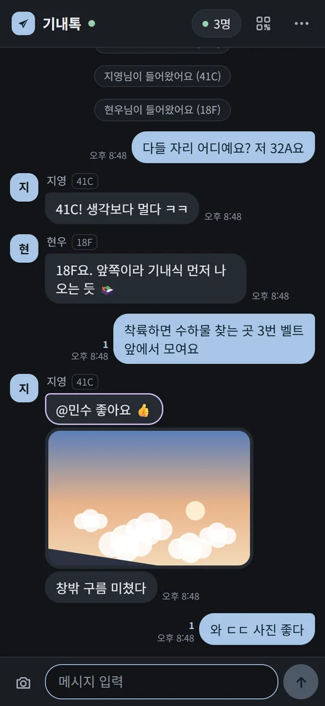
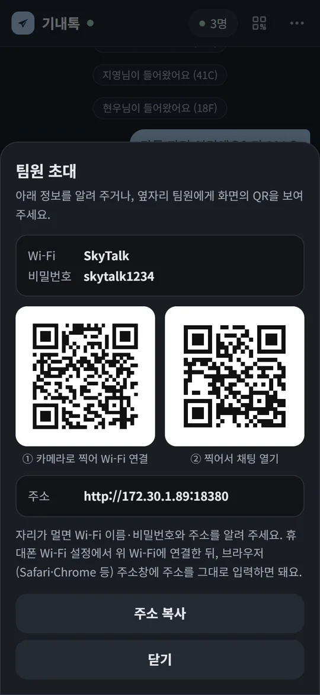
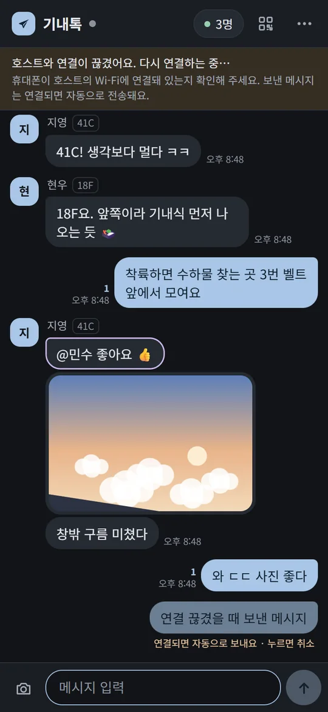
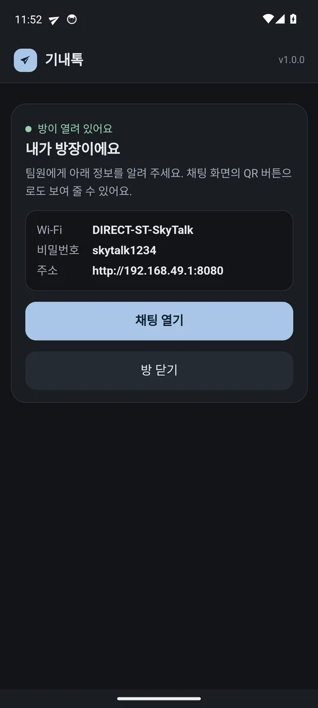

# 기내톡 (SkyTalk) ✈

**인터넷 없이 비행기 안에서 팀원끼리 쓰는 채팅**입니다.
방장 한 명의 노트북(또는 안드로이드폰)이 작은 Wi-Fi와 채팅방을 만들고, 나머지 팀원은 그 Wi-Fi에 연결해 **휴대폰 브라우저로** 들어옵니다. 앱 설치·회원가입·인터넷·데이터가 모두 필요 없고, 아이폰도 그대로 쓸 수 있습니다.

<p align="center">
  
  
  
  
</p>

> 사용 안내 페이지(휴대폰으로 보기 좋음): **https://songlomin.github.io/skytalk/**

## 어떻게 동작하나요

```
 [방장] Windows 노트북 · 안드로이드폰          [팀원] 아이폰 · 갤럭시 · 노트북
   ├ Wi-Fi를 직접 만듦 (인터넷 X)     ◀─ Wi-Fi ─▶   브라우저로 주소 열기
   └ 채팅 서버 (대화·사진 저장)                      (안드로이드는 앱도 가능)
```

- 통신은 방장 기기의 Wi-Fi 안에서만 오갑니다. 기내 Wi-Fi 결제나 휴대폰 데이터가 필요 없습니다.
- 대화와 사진은 방장 기기에만 저장됩니다. 끝나면 메뉴의 **대화 내용 저장**으로 각자 보관할 수 있습니다.

## 내려받기

| 방장 기기 | 받을 파일 | 비고 |
|---|---|---|
| **Windows 노트북** (가장 추천) | [SkyTalk-Windows.zip](https://github.com/SongLomin/skytalk/releases/latest/download/SkyTalk-Windows.zip) · [.bat 바로 받기](https://github.com/SongLomin/skytalk/releases/latest/download/SkyTalk-Windows.bat) | 설치 없음. 더블클릭으로 Wi-Fi + 채팅방 생성 |
| **안드로이드폰** | [SkyTalk.apk](https://github.com/SongLomin/skytalk/releases/latest/download/SkyTalk.apk) | Wi-Fi Direct로 비행기 모드에서도 방 생성. 팀원용 알림 앱으로도 사용 |
| Mac · Linux | [skytalk.py](https://github.com/SongLomin/skytalk/releases/latest/download/skytalk.py) | `python3 skytalk.py`. Wi-Fi는 다른 기기(폰 핫스팟·기내 Wi-Fi)로 공유 |

팀원(참가자)은 **아무것도 받을 필요가 없습니다.** 안드로이드 팀원은 원하면 APK를 설치해 화면이 꺼져 있어도 새 메시지 알림을 받을 수 있습니다.

## 1. 탑승 전에 (인터넷이 될 때)

1. **방장을 정합니다.** 노트북을 들고 타는 사람(Windows)이 1순위, 없으면 갤럭시 등 안드로이드폰.
2. **방장이 파일을 받아 둡니다.** (위 표)
3. **5분 리허설을 꼭 해 보세요.** 호텔·공항에서 방장이 실행 → 팀원 한 명이 휴대폰으로 Wi-Fi에 연결해 메시지를 한 번 보내 보면 끝입니다. 노트북마다 Wi-Fi 칩이 달라서, 미리 한 번 확인해 두는 게 가장 확실합니다.
   - 리허설은 기내와 똑같이 **모두 비행기 모드 + Wi-Fi 켬(아무 Wi-Fi에도 연결 안 함)** 상태로 해 주세요. 방장 노트북이 호텔 Wi-Fi에 연결돼 있으면 결과가 기내와 달라질 수 있어요.
   - 팀원 휴대폰도 **비행기 모드 + Wi-Fi**로 해 주세요. 모바일 데이터가 켜져 있으면 휴대폰이 "인터넷 없는 Wi-Fi" 대신 데이터로 접속하려다 주소가 안 열릴 수 있어요. (기내에서는 비행기 모드라 문제없습니다)
4. **팀 단톡방에 안내를 올려 둡니다.** (아래 [복사용 안내문](#팀-단톡방에-올릴-안내문))
5. **(선택) 백업:** 모두 [bitchat](#백업-bitchat)을 설치해 두면, 방장 기기에 문제가 생겨도 블루투스로 대화할 수 있습니다.

## 2. 기내에서 — 방장

### Windows 노트북

1. **비행기 모드를 켠 뒤 Wi-Fi만 다시 켭니다.** (아무 Wi-Fi에도 연결하지 않아도 됩니다)
2. `SkyTalk-Windows.bat`을 **더블클릭**합니다.
   - 파란 "Windows의 PC 보호" 창이 뜨면 **[추가 정보] → [실행]**
   - 관리자 권한을 묻으면 **[예]** (팀원 휴대폰이 접속하려면 필요합니다)
   - 노트북이 다른 Wi-Fi(호텔·기내 Wi-Fi 등)에 연결돼 있으면, 그 연결을 나눠 쓰는 **모바일 핫스팟**으로 켜고, 그게 안 되면 연결을 끊을지 물어봐요. **Y**를 누르면 됩니다.
3. 검은 창에 **Wi-Fi 이름 · 비밀번호 · 주소**가 나옵니다. 팀원에게 알려 주세요.
   ```
   ① Wi-Fi 이름 : SkyTalk
      비밀번호  : skytalk1234
   ② 주소창 입력: http://192.168.137.1:8080
   ```
4. 노트북 브라우저에도 채팅이 자동으로 열립니다. 방장도 여기서 대화하면 됩니다.
5. **노트북 덮개는 닫지 말고** 화면만 어둡게 해 두세요. 좌석에 전원이 있으면 충전기를 꽂아 두면 좋습니다.

> Wi-Fi 이름·비밀번호를 바꾸고 싶으면 `.bat` 파일을 메모장으로 열어 맨 위 `SKYTALK_SSID`, `SKYTALK_PASS`를 고치면 됩니다. (비밀번호 8자 이상)

### 안드로이드폰

1. **비행기 모드를 켠 뒤 Wi-Fi만 다시 켭니다.**
2. **기내톡** 앱 → **이 폰으로 방 만들기** → 권한(주변 기기·알림)을 **허용**합니다. 배터리 최적화 제외를 물으면 **허용**을 누르세요.
3. 화면에 나온 **Wi-Fi 이름(`DIRECT-ST-SkyTalk`) · 비밀번호 · 주소(`http://192.168.49.1:8080`)**를 팀원에게 알려 줍니다.
4. **채팅 열기**로 방장도 대화합니다. 화면을 꺼도 방은 유지되고, 새 메시지는 알림으로 옵니다.

### Mac · Linux

`python3 skytalk.py`로 채팅 서버를 켭니다. 다만 Mac은 인터넷 없이 Wi-Fi를 만들기 어려우므로, 팀 모두가 같은 Wi-Fi(누군가의 휴대폰 핫스팟 또는 기내 Wi-Fi 무료 접속 화면 단계)에 연결돼 있어야 합니다. 화면에 나온 주소를 팀원에게 알려 주세요.

## 3. 기내에서 — 팀원

1. 휴대폰 **설정 → Wi-Fi**에서 방장이 알려 준 Wi-Fi에 연결합니다. **"인터넷 연결 없음"이라고 떠도 정상**입니다. (계속 연결 유지를 선택)
2. **Safari**(아이폰) 또는 **Chrome·삼성 인터넷**(안드로이드) 주소창에 방장이 알려 준 주소를 그대로 입력합니다.
   - Windows 방장: `http://192.168.137.1:8080`
   - 안드로이드 방장: `http://192.168.49.1:8080`
3. 이름과 좌석을 적으면 끝입니다.

- 옆자리 팀원끼리는 화면 오른쪽 위 **QR 버튼**으로 Wi-Fi·주소 QR을 보여 주면 카메라로 바로 들어올 수 있습니다.
- 안드로이드 팀원이 **기내톡 앱 → 방 찾기**로 들어오면 화면이 꺼져 있어도 알림이 옵니다.

## 기능

- 단체 대화, 이름·좌석 표시, 접속 중인 사람 목록
- **읽음 표시**(안 읽은 사람 수), **@이름** 호출 시 강조·진동
- **사진** 보내기 (자동으로 줄여서 전송)
- 연결이 끊겨도 보낸 메시지를 보관했다가 **다시 연결되면 자동 전송**
- **팀원 초대 QR** (Wi-Fi 연결용 + 채팅 주소용)
- **대화 내용 저장**(.txt), 어두운/밝은 화면, 새 메시지 알림음
- 대화는 방장 기기에 저장되어, 방장 프로그램을 다시 켜도 이어집니다

## 알아 두면 좋은 점

- **닿는 거리:** 방장 기기의 Wi-Fi가 닿는 곳까지입니다. 기내는 사람과 좌석이 많아 거리가 줄어듭니다. 팀원들의 **가운데쯤 앉은 사람**이 방장을 맡으면 가장 좋습니다.
- **아이폰·브라우저는 백그라운드 알림이 없습니다.** 화면을 끄거나 다른 앱을 쓰는 동안 온 메시지는, 다시 열면 한꺼번에 보입니다. (안드로이드 앱은 알림이 옵니다)
- 방장 기기가 꺼지거나 절전되면 대화가 잠시 멈추고, 다시 켜면 이어집니다.
- 기내에서 Wi-Fi·블루투스는 대부분 항공사가 허용하지만, 승무원 안내가 있으면 따라 주세요.

## 문제 해결

<details>
<summary><b>주소가 안 열려요</b></summary>

- 휴대폰이 방장 Wi-Fi에 연결돼 있는지 확인하세요. (다른 Wi-Fi로 자동 전환됐을 수 있어요)
- 주소 앞의 `http://`까지 정확히 입력하세요. `https://`가 아닙니다.
- 안드로이드는 모바일 데이터가 켜져 있으면 데이터로 접속하려다 실패할 수 있어요. 비행기 모드(또는 데이터 끄기)로 해 주세요.
- 방장 화면(검은 창 / 앱)에 나온 주소를 그대로 쓰세요.
- 그래도 모르겠으면: 아이폰 **설정 → Wi-Fi → 연결된 Wi-Fi 옆 ⓘ → 라우터** 주소 뒤에 `:8080`을 붙여 여세요.
</details>

<details>
<summary><b>Windows에서 "핫스팟을 켜지 못했어요"가 떠요</b></summary>

1. Wi-Fi가 켜져 있는지 확인하세요. (비행기 모드여도 Wi-Fi는 켤 수 있어요) 창을 닫고 다시 실행합니다.
2. 기내 Wi-Fi가 있으면 노트북을 연결(결제 불필요)한 뒤 다시 실행하세요. Windows 모바일 핫스팟으로 자동 전환합니다.
3. 갤럭시 등 휴대폰 핫스팟이 켜지면(기종에 따라 비행기 모드에서는 안 켜짐) 노트북과 팀원 모두 그 핫스팟에 연결하고, 검은 창에 나온 주소를 쓰세요.
4. 회사 노트북은 보안 정책 때문에 관리자 권한·방화벽이 막혀 있을 수 있어요. 다른 사람이 방장을 맡거나 안드로이드 앱을 쓰세요.
</details>

<details>
<summary><b>다운로드할 때 경고가 떠요</b></summary>

- 브라우저: `.bat`·`.apk` 파일은 원래 경고가 뜹니다. **[유지]**·**[무시하고 다운로드]**를 누르세요. 경고가 싫으면 `.zip`을 받아 압축을 푸세요.
- Windows: "PC 보호" 창 → **[추가 정보] → [실행]**
- 안드로이드: "출처를 알 수 없는 앱" 설치 허용 → **[설치]**. Play 프로텍트 창이 뜨면 **[세부정보] → [무시하고 설치]**
- 코드는 모두 이 저장소에 공개돼 있습니다.
</details>

<details>
<summary><b>안드로이드에서 "Wi-Fi Direct를 다른 기능이 쓰고 있어요"</b></summary>

Quick Share, 스마트 뷰(화면 미러링) 같은 기능을 끄고 다시 시도하세요. 그래도 안 되면 휴대폰을 껐다 켭니다.
</details>

<details>
<summary><b>안드로이드 앱이 몇 시간 뒤 꺼져요</b></summary>

설정 → 애플리케이션 → 기내톡 → 배터리 → **제한 없음**으로 바꾸세요. (갤럭시: "사용하지 않는 앱을 절전 상태로 전환"에서도 빼 주세요)
</details>

## 팀 단톡방에 올릴 안내문

```
✈ 비행기에서 쓸 팀 채팅 (기내톡) — 인터넷 필요 없어요
방장: OOO (Windows 노트북 / 안드로이드폰)

[기내에서]
1) 비행기 모드 켜고 Wi-Fi만 다시 켜기
2) 설정 > Wi-Fi > "SkyTalk" 연결 (비밀번호 skytalk1234)
   ※ 안드로이드폰 방장이면 "DIRECT-ST-SkyTalk"
   ※ "인터넷 연결 없음" 떠도 정상
3) Safari/Chrome 주소창에 입력
   http://192.168.137.1:8080   (노트북 방장)
   http://192.168.49.1:8080    (안드로이드폰 방장)
4) 이름·좌석 입력하면 끝!

안드로이드는 앱으로 들어오면 알림도 와요(선택): https://songlomin.github.io/skytalk/
```

## 백업: bitchat

방장 기기를 못 쓰는 상황을 대비해, 모두 **탑승 전에** [bitchat](http://bitchat.free)을 설치해 두면 좋습니다. 인터넷 없이 블루투스로 주변 휴대폰끼리 메시지를 주고받고, 팀원 폰을 거쳐 최대 7단계까지 전달됩니다. ([iOS App Store](https://apps.apple.com/app/bitchat-mesh/id6748219622) · [Google Play](https://play.google.com/store/apps/details?id=com.bitchat.droid))
블루투스는 Wi-Fi보다 닿는 거리가 짧지만, 앱만 깔려 있으면 따로 방장이 필요 없습니다.

## 개발자용

```
src/client.html     채팅 화면 (모든 방장이 같은 화면을 제공)
src/server.ps1      Windows 방장: PowerShell 채팅 서버 + Wi-Fi Direct 핫스팟
src/skytalk.py      Mac·Linux·Termux 방장: Python 표준 라이브러리만 사용
android/            안드로이드 앱: 방장(Wi-Fi Direct + 채팅 서버) / 참가자(알림)
build.py            client.html을 각 서버에 넣어 dist/를 만듦
tests/              API 테스트(모든 방장 공통), 브라우저 화면 테스트, 색 대비 검사, 에뮬레이터 테스트
```

- 서버 API: `GET /api/poll`(롱폴링), `POST /api/send`, `POST /api/upload`, `GET /img/<id>`, `GET /api/info`
- 테스트: `python build.py && python tests/api_test.py python` / `python tests/api_test.py windows` / `cd tests/ui && npm i && node ui_test.mjs python`
- 안드로이드 APK는 GitHub Actions가 빌드하고, 에뮬레이터 안에서 같은 API 테스트를 돌린 뒤 올립니다.

MIT License
